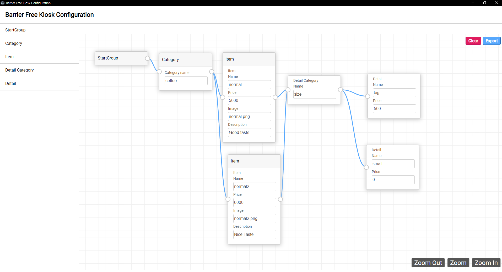

# Barrier Free Kisok Menu App
This is part of barrier free kiosk project  
For making configuration file more easier  

# Preview


<details>
<summary>Example configuration file</summary>

```json
{
  "category": [
    {
      "title": "coffee",
      "items": [
        0,
        1
      ],
      "details": [
        [
          0
        ],
        [
          0
        ]
      ]
    }
  ],
  "detail_categories": [
    {
      "name": "size",
      "details": [
        {
          "name": "big",
          "price": "500"
        },
        {
          "name": "small",
          "price": "0"
        }
      ]
    }
  ],
  "items": [
    {
      "name": "normal",
      "price": "5000",
      "image": "normal.png",
      "description": "Good taste"
    },
    {
      "name": "normal2",
      "price": "6000",
      "image": "normal2.png",
      "description": "Nice Taste"
    }
  ]
}
```
</details>